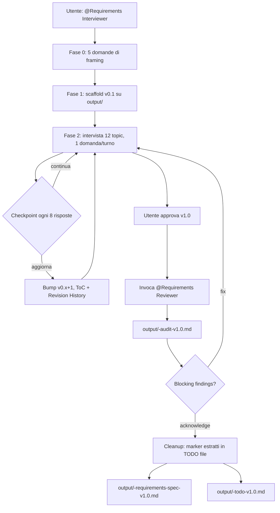

# Document Requirements Interviewer

Un set di **agenti GitHub Copilot Chat** e **skills** per condurre interviste strutturate di raccolta requisiti software e produrre documenti SRS (Software Requirements Specification) conformi a:

- **BABOK® Guide v3** (IIBA) — tecniche di elicitazione
- **SWEBOK Guide v4** (IEEE Computer Society) — copertura dei macro topic
- **ISO/IEC/IEEE 29148:2018** — regole normative per i requisiti
- **Wiegers / Seilevel** SRS template (cover, ToC, revision history, 10 sezioni standard)

L'output finale è un file Markdown professionale, in italiano o in inglese, pronto per essere versionato in repo o esportato in formati documentali.

---

## Come è organizzato il workspace

```
.github/
  agents/                      # Le 3 agenti del workflow
    requirements-interviewer.agent.md
    requirements-reviewer.agent.md
    requirements-interviewer-tester.agent.md
  skills/                      # Skill knowledge base consultate dagli agenti
    babok-v3-software-requirements/
    swebok-v4-software-requirements/
    iso-29148-software-requirements/
    software-requirements-spec/
output/                        # Dove finiscono i documenti prodotti
  <progetto>-requirements-spec-vX.Y.md
  <progetto>-audit-vX.Y.md     # creato dal Reviewer a v1.0
  <progetto>-todo-v1.0.md      # creato durante la promozione a v1.0
```

---

## Gli agenti

### 1. Requirements Interviewer

**Quando usarlo**: ogni volta che vuoi produrre un documento SRS partendo da una conversazione (stakeholder, note frammentarie, racconto narrativo).

**Trigger di chat**:

- `@Requirements Interviewer` seguito da una descrizione del progetto in una frase (opzionale).
- Frasi chiave: *"avvia intervista requisiti"*, *"requirements interview"*, *"fammi le domande per lo SRS"*, *"guidami nella raccolta requisiti"*.

**Cosa fa, in breve**:

1. **Fase 0 — Framing**: rileva la lingua dal primo messaggio e chiede 5 informazioni di base:
   1. nome del progetto,
   2. autore (+ organizzazione),
   3. livello di compliance — `strict` (regole ISO/SWEBOK/BABOK applicate rigidamente) o `relaxed`,
   4. tipo di output — `srs` (formale), `backlog` (importabile in Azure DevOps / Jira) o `hybrid`,
   5. vocabolario di prioritizzazione — `mro` (Mandatory / Required / Optional, default) o `moscow` (Must / Should / Could, in italiano *deve / dovrebbe / potrebbe*).
2. **Fase 1 — Scaffold**: crea `output/<slug>-requirements-spec-v0.1.md` copiando il template Wiegers/Seilevel localizzato e iscrive un blocco di framing `<!-- framing -->` per il Reviewer.
3. **Fase 2 — Intervista**: una domanda per turno, attraversando 12 macro-topic in ordine (scope → funzionali → dati → interfacce → NFR → sicurezza → safety → compliance → ambiente → i18n → testing → traceability). Disambigua i termini vaghi (*veloce*, *sicuro*, *user-friendly*) forzando numeri misurabili. Applica i 5-Whys quando l'utente propone una soluzione invece di un bisogno.
4. **Fase 3 — Checkpoint ogni ~8 domande**: chiede se aggiornare il file (bump di versione `v0.x` → `v0.x+1`) o continuare.
5. **Fase 4 — Promozione a v1.0**: invoca il `Requirements Reviewer`, mostra i Blocking findings, e dopo conferma dell'utente esegue la **cleanup procedure**:
   - estrae tutti i marcatori aperti (`[DA CHIARIRE]`, `[CONFLITTO STAKEHOLDER]`, `[ASSUNZIONE]`, `IN SOSPESO` — e i loro equivalenti inglesi) in una tabella;
   - rimuove i marcatori dalla v1.0 (il documento finale è "pulito");
   - scrive `output/<slug>-todo-v1.0.md` con tutti gli item aperti, ordinati per severità, come backlog di follow-up;
   - emette `output/<slug>-requirements-spec-v1.0.md` firmato in Revision History.

**Marker di annotazione** (sempre nella lingua del documento):

| English | Italiano | Significato |
|---|---|---|
| `[NEEDS CLARIFICATION: ...]` | `[DA CHIARIRE: ...]` | Info mancante richiesta da una checklist Critical/High |
| `[ASSUMPTION (unconfirmed): ...]` | `[ASSUNZIONE (non confermata): ...]` | Assunzione operativa non confermata dall'utente |
| `[CONFLICT: A vs B — owner: ...]` | `[CONFLITTO STAKEHOLDER: A vs B — owner: ...]` | Contraddizione fra stakeholder |
| `[OUT OF SCOPE]` | `[FUORI SCOPO]` | Esplicitamente escluso (resta nel v1.0) |
| `TBD` | `IN SOSPESO` | Dettaglio funzionale da fornire (solo in §3.x.3) |

**File prodotti**:

- `output/<slug>-requirements-spec-v0.1.md` … `vX.Y.md` (drafts)
- `output/<slug>-requirements-spec-v1.0.md` (approvato, pulito)
- `output/<slug>-audit-v1.0.md` (delegato al Reviewer)
- `output/<slug>-todo-v1.0.md` (backlog items aperti)

---

### 2. Requirements Reviewer

**Quando usarlo**: per **audit** di un documento SRS esistente — tipicamente prima della promozione a v1.0, oppure per triage di un documento ereditato.

**Trigger di chat**:

- `@Requirements Reviewer <path>` (es. `@Requirements Reviewer output/arredocasa-requirements-spec-v0.5.md`)
- Frasi chiave: *"audit SRS"*, *"requirements review"*, *"verifica conformità ISO 29148"*, *"fai il quality gate del SRS"*.

**Cosa fa**:

- Read-only sull'SRS auditato; **scrive un solo file**: `output/<slug>-audit-<version>.md`.
- Cammina meccanicamente **ogni checklist** del workspace:
  - Strutturale (template Wiegers/Seilevel)
  - Elicitazione BABOK v3 (35 righe)
  - Software Requirements / Testing / Quality / Security SWEBOK v4 (33+30+25+28 righe)
  - ISO/IEC/IEEE 29148 conformance (30 righe document-level) + requirement writing (25 righe, campionate su almeno 10 requisiti)
- Per ogni riga emette un verdetto: **Pass / Partial / Fail / N/A**, citando sempre (a) ID checklist row, (b) §/riga nel documento, (c) quote di evidenza.
- Riconosce sia i marcatori inglesi sia gli italiani; segnala come `IR-002 Fail` qualsiasi marcatore "fuori lingua" (es. `[NEEDS CLARIFICATION]` in un documento italiano).
- Onora il `priority-vocabulary` letto dal blocco di framing: se l'utente ha scelto `moscow`, non penalizza l'uso di Must/Should/Could come label di priorità (continua a richiedere `shall`/`deve` come *verbo normativo*, separato).

**Output**: file `output/<slug>-audit-<version>.md` con:

- summary verdetto per source × severità
- **tabella dei findings** con `Row ID | Source | Severity | Verdict | Where | Reason | Short example of resolution`
- dettaglio Blocking findings (Critical Fail) e High-risk findings
- per-requirement audit (campionato)
- righe N/A motivate

L'agente NON modifica il documento auditato e NON propone riscritture (solo brevi "example of resolution" di una frase per riga).

---

### 3. Requirements Interviewer Tester

**Quando usarlo**: solo per **end-to-end testing** del `Requirements Interviewer` — non è uno strumento per uso reale.

**Trigger**:

- `@Requirements Interviewer Tester`
- Frasi chiave: *"testa requirements-interviewer"*, *"simula stakeholder"*, *"avvia test ArredoCasa"*.

**Cosa fa**:

- Recita la persona di **Marco Bianchi**, COO di VenditaMobili s.r.l. (Verona), product owner del progetto fittizio **ArredoCasa** (e-commerce B2C di mobili).
- Risponde sempre in italiano, una risposta per turno, applicando pattern umani (vaghezza, auto-correzione, solution-talk, conflitti fra stakeholder, ripensamenti ritardati).
- **Strategia di basso consumo token**: mantiene un file di stato compatto su `output/.test-session/<slug>-tester-state.md` (≤ 80 righe) anziché passare l'intera trascrizione ad ogni invocazione del subagente. L'Interviewer ricostruisce lo stato leggendo l'SRS in lavorazione (single source of truth) più questo stato sintetico.
- Cancella il file di stato a fine sessione.

---

## Le skill (knowledge base)

Le skill sono consultate dagli agenti (via `read_file` sul `SKILL.md`) prima di prendere decisioni. Non sono direttamente invocabili dall'utente.

### `babok-v3-software-requirements`

Tecniche di elicitazione del BABOK v3: interviste, workshop, observation, brainstorming, focus group, survey, prototyping, document analysis. Domande tipiche, regole di disambiguazione, gestione dei conflitti, banca domande per ogni tecnica.

**Usata da**: Interviewer (per *come* condurre la conversazione), Reviewer (checklist elicitazione).

### `swebok-v4-software-requirements`

Macro topic SWEBOK v4: Software Requirements KA + Software Testing KA + Software Quality KA + Software Security KA. Definisce quali aree devono essere coperte in un'intervista completa (funzionali, NFR/QoS, sicurezza, testing, qualità, compliance, traceability).

**Usata da**: Interviewer (per ordinare i topic in Fase 2), Reviewer (4 checklist: requirements / testing / quality / security).

### `iso-29148-software-requirements`

Norma ISO/IEC/IEEE 29148:2018: regole per requisiti ben formati (`shall`, unambiguous, verifiable, singular, complete, no vague terms), caratteristiche di set di requisiti, struttura canonica di BRS / StRS / SyRS / SRS.

**Usata da**: Interviewer (per la verbosità normativa `shall`/`deve` e gli attributi), Reviewer (checklist conformance + checklist requirement writing applicata per-requisito).

### `software-requirements-spec`

Template Markdown Wiegers/Seilevel dell'SRS: cover, ToC, Revision History, 10 sezioni standard, regole `3.x.1 / 3.x.2 / 3.x.3` per le funzionalità, glossario, acronimi. Disponibile in due varianti: `srs-template.md` (EN) e `srs-template-it.md` (IT).

**Usata da**: Interviewer (per creare lo scaffold iniziale del documento), Reviewer (validation strutturale).

---

## Workflow tipico



---

## Convenzioni di formato

- **Niente emoji, niente icone Unicode** nei documenti prodotti. Solo Markdown standard (heading, paragrafi, liste, tabelle, fenced code block, blockquote, link, diagrammi Mermaid).
- **Lingua decisa una volta sola in Fase 0** e mai cambiata mid-session. Testo normativo mixed-language è un errore (`IR-002 Fail`).
- **Verbo normativo**: `shall` in inglese, `deve` in italiano. Mai `must` / `dovrà` come verbo del requisito (sono permessi solo come label di priorità se `priority-vocabulary: moscow`).
- **File path**: tutti gli output vanno in `output/`. Slug del progetto = lowercase, ASCII, parole unite da `-`.

---

## Prerequisiti

- VS Code con estensione **GitHub Copilot Chat** abilitata.
- I file `.agent.md` in `.github/agents/` vengono caricati automaticamente da Copilot Chat come agenti custom.
- I file `SKILL.md` in `.github/skills/<nome>/` vengono caricati come skill consultabili dagli agenti.
- Nessuna dipendenza runtime (Python, Node, ecc.) per l'uso degli agenti. Il `.venv/` presente nel repo è opzionale e serve solo a tooling locale.

---

## Esempio di sessione (italiano)

```text
Utente: @Requirements Interviewer Vorrei fare i requisiti del nostro nuovo
        e-commerce di mobili.
Agent:  Ciao! Sono il tuo intervistatore... [5 domande di framing]
Utente: Si chiama ArredoCasa, autore Marco Bianchi di VenditaMobili,
        compliance strict, output srs, vocabolario mro.
Agent:  [crea output/arredocasa-requirements-spec-v0.1.md]
        Perfetto. Iniziamo dallo scope: in 1-2 frasi, qual è il problema
        che ArredoCasa deve risolvere?
...
[dopo ~8 domande]
Agent:  Vuoi che aggiorni il documento alla v0.2 o continuiamo?
Utente: Salviamo.
Agent:  Salvato a output/arredocasa-requirements-spec-v0.2.md.
        Prossima domanda...
...
Utente: Va bene, promuovi a v1.0.
Agent:  [invoca Requirements Reviewer]
        Audit completato. 2 Blocking findings:
        - IR-002 su NFR-PERF-02: usa "must" invece di "deve" ...
        Vuoi fix / acknowledge / abort?
Utente: Acknowledge.
Agent:  Pulito 7 marker dal documento, migrati in
        output/arredocasa-todo-v1.0.md.
        v1.0 firmata: output/arredocasa-requirements-spec-v1.0.md.
```

---

## License & credits

Skill e agenti sviluppati internamente. Il template SRS è basato sul lavoro pubblico di Karl Wiegers e Seilevel; le checklist normative derivano da BABOK® v3 (© IIBA), SWEBOK Guide v4 (© IEEE Computer Society) e ISO/IEC/IEEE 29148:2018 — i marchi appartengono ai rispettivi proprietari.
